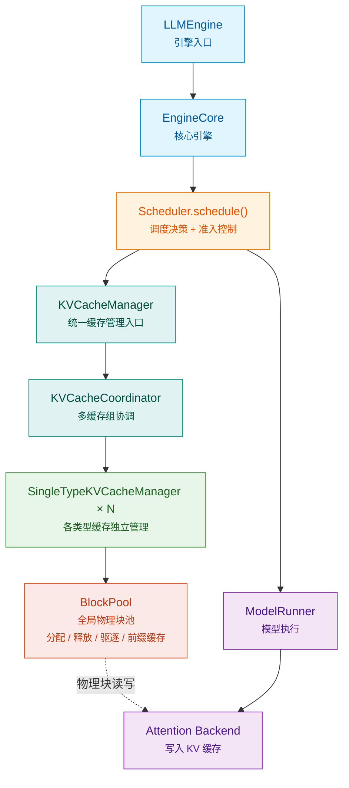
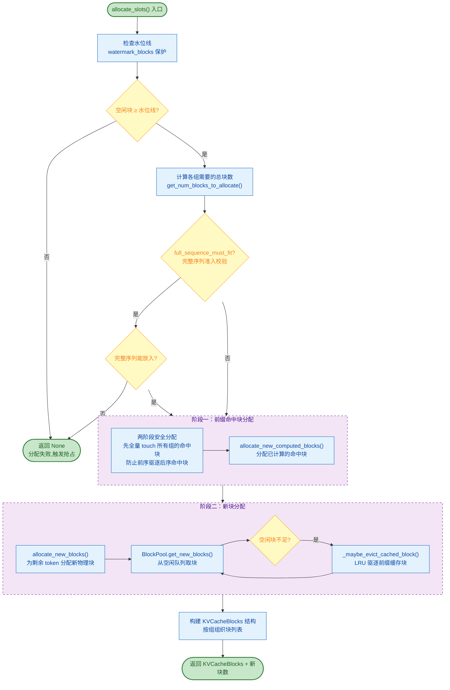
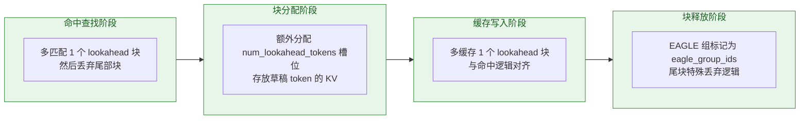

# KV Cache 调用结构树

本文档从多个维度展示 KV Cache 系统的完整调用链路，帮助深入理解从请求进入到缓存分配、命中查询、块释放的全流程。

---

## 一、核心调用链路简图

精简展示 KV Cache 从请求进入到物理缓存的主干调用路径，快速把握六层架构。

📐 六层主干链路 · 从上到下依次为引擎入口 → 调度决策 → 缓存协调 → 缓存管理 → 物理块池 → 模型执行

---

## 二、分层组件架构浏览器

点击每层卡片展开查看该层的全部组件、职责说明以及上下游调用关系。支持逐层展开或一键全部展开/收起。

<!-- ═══════════════ Architecture Explorer ═══════════════ -->

<button class="arch-btn-expand-all" markdown="1">📂 全部展开</button>
<button class="arch-btn-collapse-all" markdown="1">📁 全部收起</button>

<!-- ─── Layer 1: Engine ─── -->

<button class="arch-layer-header" aria-expanded="false" markdown="1">
🧱

引擎入口层
LLMEngine · EngineCoreClient · InputProcessor · OutputProcessor

▸
</button>

🔧 组件

<a href="../api/llm_engine/" class="arch-component" markdown="1">
LLMEngine
对外兼容封装，接收用户请求并驱动整个生成流程
</a>

<a href="../api/llm_engine/" class="arch-component" markdown="1">
EngineCoreClient
核心引擎客户端，将请求注册到引擎核心
</a>

<a class="arch-component" markdown="1">
InputProcessor
输入预处理：tokenize、prompt 格式化
</a>

<a class="arch-component" markdown="1">
OutputProcessor
输出后处理：detokenize、streaming 封装
</a>

🔗 下游调用

↓
将请求交付 <code>Scheduler.schedule()</code> 进行调度决策

<!-- ─── Layer 2: Scheduler ─── -->

<button class="arch-layer-header" aria-expanded="false" markdown="1">
⚙️

调度决策层
Scheduler · 等待/运行队列 · 抢占 · 推测解码 · KVConnector

▸
</button>

🔧 组件

<a href="../api/scheduler/" class="arch-component" markdown="1">
Scheduler.schedule()
统一 token 预算调度，决定每步执行哪些请求
</a>

<a class="arch-component" markdown="1">
waiting / skipped_waiting
等待队列：缓存不足时挂起请求
</a>

<a class="arch-component" markdown="1">
running
运行队列：已分配缓存、正在执行的请求
</a>

<a class="arch-component" markdown="1">
_preempt_request()
抢占机制：回收低优先级请求的缓存
</a>

<a class="arch-component" markdown="1">
推测解码支持
EAGLE / Draft / DFlash 多模式
</a>

<a class="arch-component" markdown="1">
KVConnector
分布式 KV 传输，跨节点缓存同步
</a>

<a class="arch-component" markdown="1">
EncoderCacheManager
多模态编码器缓存管理
</a>

🔗 上下游

↑
由 <code>EngineCore</code> 调用

↓
调用 <code>KVCacheManager</code> 分配缓存；调用 <code>ModelRunner</code> 执行推理

<!-- ─── Layer 3: Coordinator ─── -->

<button class="arch-layer-header" aria-expanded="false" markdown="1">
🔀

缓存协调层
KVCacheCoordinator (ABC) · NoPrefixCache · Unitary · Hybrid · SpecGroup

▸
</button>

🔧 组件

<a href="../api/kv_cache_coordinator/" class="arch-component" markdown="1">
KVCacheCoordinator (ABC)
协调器抽象基类，定义统一接口
</a>

<a href="../api/kv_cache_coordinator/" class="arch-component" markdown="1">
NoPrefixCache
无前缀缓存模式，每次全量分配
</a>

<a href="../api/kv_cache_coordinator/" class="arch-component" markdown="1">
Unitary
单缓存组，一种注意力类型
</a>

<a href="../api/kv_cache_coordinator/" class="arch-component" markdown="1">
Hybrid
混合多缓存组，不动点迭代协调
</a>

<a class="arch-component" markdown="1">
get_kv_cache_coordinator()
工厂函数，按模型配置创建协调器
</a>

<a class="arch-component" markdown="1">
SpecGroup
规格分组单元，按块大小分组管理
</a>

🔗 上下游

↑
由 <code>KVCacheManager</code> 调用，通过工厂函数创建

↓
委托 <code>SingleTypeKVCacheManager × N</code> 执行各类型缓存操作

<!-- ─── Layer 4: Cache Manager ─── -->

<button class="arch-layer-header" aria-expanded="false" markdown="1">
📦

缓存管理层
KVCacheManager · KVCacheBlocks · SingleTypeKVCacheManager · allocate_slots

▸
</button>

🔧 组件

<a href="../api/kv_cache_manager/" class="arch-component" markdown="1">
KVCacheManager
统一缓存管理器入口，对外暴露 allocate / free
</a>

<a class="arch-component" markdown="1">
KVCacheBlocks
缓存块数据结构，按组组织块列表
</a>

<a class="arch-component" markdown="1">
SingleTypeKVCacheManager
单类型缓存管理：全注意力 / 滑动窗口 / Mamba / 交叉注意力
</a>

<a class="arch-component" markdown="1">
find_longest_cache_hit()
前缀命中查找，复用已计算 KV 块
</a>

<a class="arch-component" markdown="1">
allocate_slots()
槽位分配核心：命中块复用 + 新块分配
</a>

<a class="arch-component" markdown="1">
free / pop_blocks_for_free
块释放接口，支持立即释放与延迟释放
</a>

<a class="arch-component" markdown="1">
retention_interval
稀疏缓存保留策略
</a>

🔗 上下游

↑
由 <code>Scheduler</code> 调用，入口为 <code>allocate_slots()</code>

↓
向下委托 <code>KVCacheCoordinator</code> 协调多类型；最终操作 <code>BlockPool</code>

<!-- ─── Layer 5: Block Pool ─── -->

<button class="arch-layer-header" aria-expanded="false" markdown="1">
💾

物理块池层
BlockPool · BlockHashToBlockMap · FreeQueue · evict_blocks · 指标收集

▸
</button>

🔧 组件

<a href="../api/block_pool/" class="arch-component" markdown="1">
BlockPool
全局物理块池：分配、释放、驱逐、前缀缓存
</a>

<a class="arch-component" markdown="1">
BlockHashToBlockMap
哈希 → 块 双向索引，加速前缀命中查找
</a>

<a class="arch-component" markdown="1">
FreeKVCacheBlockQueue
空闲块队列，O(1) 获取与归还
</a>

<a class="arch-component" markdown="1">
cached_block_hash_to_block
前缀缓存块表，LRU 体系核心
</a>

<a class="arch-component" markdown="1">
evict_blocks()
LRU 驱逐策略：最久未用优先回收
</a>

<a class="arch-component" markdown="1">
null_block
空块占位符，填充无效槽位
</a>

<a class="arch-component" markdown="1">
KV Event Queue
事件驱动可观测，追踪分配/释放事件
</a>

<a class="arch-component" markdown="1">
KVCacheMetricsCollector
指标收集器：命中率、使用率、驱逐次数
</a>

🔗 上下游

↑
由 <code>SingleTypeKVCacheManager</code> 直接操作

↓
物理块被 <code>Attention Backend</code> 读写，写入 KV 值

<!-- ─── Layer 6: Model ─── -->

<button class="arch-layer-header" aria-expanded="false" markdown="1">
🚀

模型执行层
ModelRunner · Attention Backend

▸
</button>

🔧 组件

<a class="arch-component" markdown="1">
ModelRunner
模型执行器：构建输入张量、执行前向传播、采样
</a>

<a class="arch-component" markdown="1">
Attention Backend
根据 slot_mapping 将 KV 值写入对应物理块位置
</a>

🔗 上下游

↑
由 <code>Scheduler</code> 调用 <code>ModelRunner</code> 执行推理

↕
<code>Attention Backend</code> 读写 <code>BlockPool</code> 中的物理块

<!-- ═══════════════ End Architecture Explorer ═══════════════ -->

---

## 三、前缀缓存命中查询流程

新请求进入调度时，首先执行前缀缓存命中查找，尽可能复用已计算的 KV 块，避免重复计算。

🔍 命中查找路径 · 从 Scheduler → KVCacheCoordinator → BlockPool

📖 混合组不动点迭代说明

对于多层混合注意力模型（部分全注意力 + 部分滑动窗口），不同组的块大小、缓存策略不同，**不动点迭代算法**保证所有组最终认可同一个命中长度：

1. 初始命中长度设为最大值
2. 依次让每个规格组校验该长度，不满足则缩短
3. 长度单调递减，最终收敛到所有组都认可的最长公共前缀

---

## 四、KV 块分配完整流程

调度器确认准入后，调用 <code>allocate_slots()</code> 完成块分配，包含前缀命中块复用 + 新块分配两阶段。

📦 分配流程 · 两阶段安全分配：先 touch 命中块 → 再分配新块

📖 两阶段安全分配的意义

跨多个缓存组时，如果一组一组地分配，前一组分配新块时可能驱逐掉后一组尚未引用的前缀命中块。**先全量 touch 所有命中块，再分配新块**，彻底避免该竞态问题。

---

## 五、块释放与驱逐流程

请求完成、被抢占或滑动窗口移出时，触发块释放。释放路径分为「立即释放」与「延迟释放」两种。

🗑️ 释放驱逐路径 · 逆序归还 · 引用计数共享 · 延迟释放栅栏 · 分级 LRU

📖 关键设计细节

1. **逆序归还**：尾部块先归还，下次分配时优先拿到尾部块，提升前缀缓存连续命中概率
2. **引用计数共享**：同一块可被多个请求的前缀缓存共享引用，只有引用归零才真正释放
3. **延迟释放栅栏**：多批次重叠场景下，按 `processed_step_seq` 栅栏安全释放，防止异步写入时块被重新分配
4. **分级 LRU**：空闲块队列 + 缓存块表形成两级 LRU，缓存块被驱逐后进入空闲队列，可二次利用

---

## 六、推测解码（EAGLE）KV 特殊处理

EAGLE 推测解码在 KV 缓存层有特殊适配，贯穿命中查找、块分配、缓存写入全链路。

🦅 EAGLE 全链路适配 · 四阶段特殊处理

