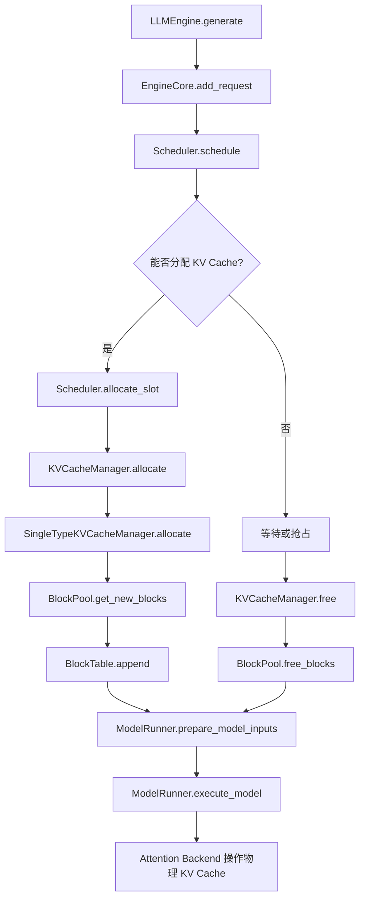

# KV Cache 调用结构树

下图展示了 vLLM 中 KV Cache 从请求进入到实际分配的完整调用链路。点击节点可跳转到对应 API 文档。

```mermaid
flowchart TD
    A[LLMEngine.generate] --> B[EngineCore.add_request]
    B --> C[Scheduler.schedule]
    C --> D{能否分配 KV Cache?}
    D -- 是 --> E[Scheduler.allocate_slot]
    D -- 否 --> F[等待或抢占]
    E --> G[KVCacheManager.allocate]
    G --> H[SingleTypeKVCacheManager.allocate]
    H --> I[BlockPool.get_new_blocks]
    I --> J[BlockTable.append]
    F --> K[KVCacheManager.free]
    K --> L[BlockPool.free_blocks]
    J --> M[ModelRunner.prepare_model_inputs]
    L --> M
    M --> N[ModelRunner.execute_model]
    N --> O[Attention Backend 操作物理 KV Cache]

    click A "../api/llm_engine/#llmengine.generate"
    click B "../api/llm_engine/#enginecore.add_request"
    click C "../api/scheduler/#scheduler.schedule"
    click E "../api/scheduler/#scheduler.allocate_slot"
    click G "../api/kv_cache_manager/#kvcachemanager.allocate"
    click H "../api/kv_cache_manager/#singletypekvcachemanager.allocate"
    click I "../api/block_pool/#blockpool.get_new_blocks"
    click K "../api/kv_cache_manager/#kvcachemanager.free"
    click L "../api/block_pool/#blockpool.free_blocks"
```

> **提示**：以上链接为示例路径，实际锚点名称取决于 mkdocstrings 生成的标题 ID。部署后可根据实际页面调整 `click` 目标地址。
