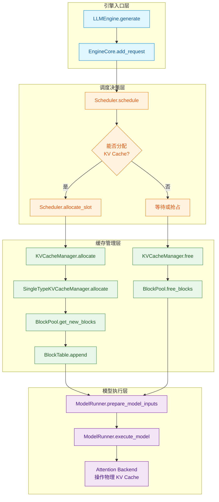

# KV Cache 调用结构树

下图按**模块分层**展示了 KV Cache 从请求到分配到执行的完整链路。  
**颜色标识**： 引擎入口 →  调度决策 →  缓存分配/回收 →  模型执行



---

## 节点说明（点击展开）

以下按模块分组，解释每个关键节点的职责与典型调用时机。

###  引擎入口层

??? info "LLMEngine.generate"
    **职责**：对外的总入口，接收用户请求（prompt + sampling params），驱动整个生成流程。  
    **典型调用**：每次用户发送一次对话请求时触发。  
    → 详细 API 见 [LLMEngine.generate](../api/llm_engine/#llmengine.generate)

??? info "EngineCore.add_request"
    **职责**：将请求封装并注册到引擎核心，分配给 Scheduler 调度。  
    **调用时机**：`LLMEngine` 收到新请求后立即调用。  
    → 详细 API 见 [EngineCore.add_request](../api/llm_engine/#enginecore.add_request)

###  调度决策层

??? info "Scheduler.schedule"
    **职责**：核心调度器，决定下一个 step 哪些请求可以执行、哪些需要等待或抢占。  
    **关键逻辑**：比较所需 KV Cache 与当前可用块数，若不足则触发抢占。  
    → 详细 API 见 [Scheduler.schedule](../api/scheduler/#scheduler.schedule)

??? info "能否分配 KV Cache？（决策分支）"
    - **是** → 调用 `allocate_slot` 分配新物理块。  
    - **否** → 进入抢占/等待流程，调用 `free` 回收其他请求的块。

??? info "Scheduler.allocate_slot"
    **职责**：为请求分配调度槽位，并调用 `KVCacheManager` 获取物理块。  
    → 详细 API 见 [Scheduler.allocate_slot](../api/scheduler/#scheduler.allocate_slot)

??? info "等待或抢占"
    **说明**：当内存不足时，Scheduler 可能选择暂停当前请求或抢先回收低优先级请求的缓存。  
    具体策略请参阅 `Scheduler` 内部关于抢占的实现。

###  缓存管理层

??? info "KVCacheManager.allocate"
    **职责**：协调不同 KV 类型（如普通 KV 与跨层共享 KV）的统一分配，委托给 `SingleTypeKVCacheManager`。  
    → 详细 API 见 [KVCacheManager.allocate](../api/kv_cache_manager/#kvcachemanager.allocate)

??? info "SingleTypeKVCacheManager.allocate"
    **职责**：针对单一数据类型的物理块分配，调用 `BlockPool` 的底层方法。  
    → 详细 API 见 [SingleTypeKVCacheManager.allocate](../api/kv_cache_manager/#singletypekvcachemanager.allocate)

??? info "BlockPool.get_new_blocks"
    **职责**：从物理块池的空闲队列中取出所需数量的块。  
    **关键**：如果空闲块不足，返回失败，上层将触发抢占。  
    → 详细 API 见 [BlockPool.get_new_blocks](../api/block_pool/#blockpool.get_new_blocks)

??? info "BlockTable.append"
    **职责**：将新分配的物理块 ID 追加到请求的逻辑块表中，建立映射关系。  
    → 详细 API 见 [BlockTable.append](../api/block_table/#blocktable.append)

??? info "KVCacheManager.free"
    **职责**：释放请求占用的所有物理块，通常发生在请求完成或被抢占时。  
    → 详细 API 见 [KVCacheManager.free](../api/kv_cache_manager/#kvcachemanager.free)

??? info "BlockPool.free_blocks"
    **职责**：减少块的引用计数，当引用计数为零时将其放回空闲队列。  
    → 详细 API 见 [BlockPool.free_blocks](../api/block_pool/#blockpool.free_blocks)

###  模型执行层

??? info "ModelRunner.prepare_model_inputs"
    **职责**：构建模型前向所需的 `block_table`、`slot_mapping` 等张量，将逻辑块映射转为物理地址。  
    → 详细 API 见 [ModelRunner.prepare_model_inputs](../api/model_runner/#modelrunner.prepare_model_inputs)

??? info "ModelRunner.execute_model"
    **职责**：执行一次模型前向传播，计算 logits 并采样下一个 token。  
    → 详细 API 见 [ModelRunner.execute_model](../api/model_runner/#modelrunner.execute_model)

??? info "Attention Backend 操作物理 KV Cache"
    **职责**：根据 `slot_mapping` 将当前 token 的 KV 值写入对应物理块的位置，完成缓存更新。  
    → 不同后端（FlashAttention、xFormers）实现细节有差异，详见 `attention` 目录。

```


