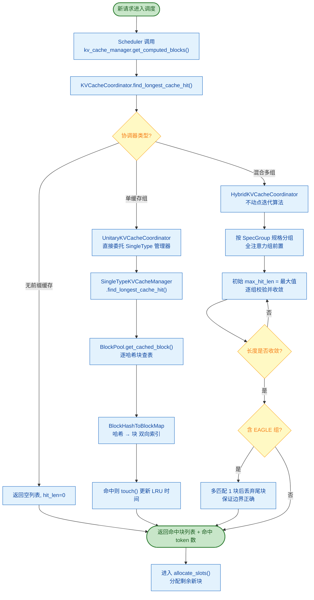
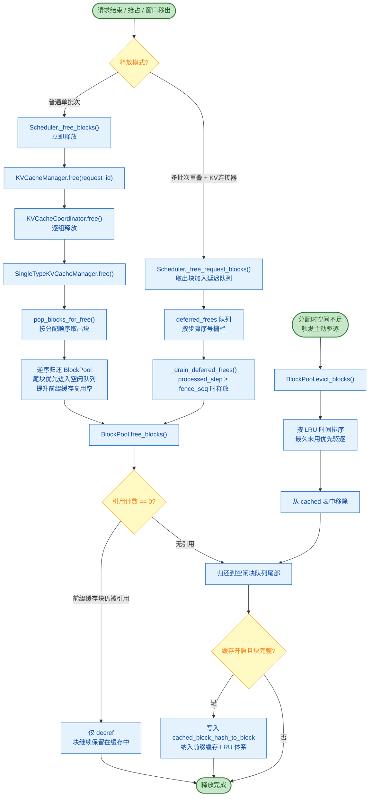
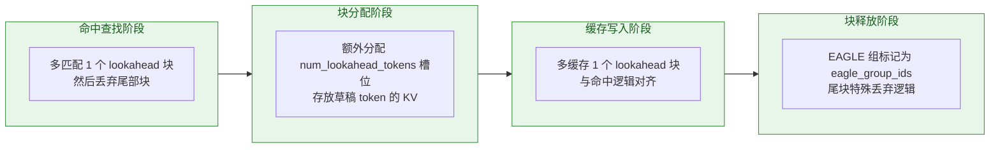

```mermaid
flowchart TD
    %% ========== 引擎入口层 ==========
    subgraph Engine["🧱 引擎入口层"]
        direction TB
        LLMEngine["LLMEngine<br><small>对外兼容封装</small>"]
        EngineCore["EngineCore / EngineCoreClient<br><small>核心引擎客户端</small>"]
        InputProc["InputProcessor<br><small>输入预处理</small>"]
        OutputProc["OutputProcessor<br><small>输出后处理</small>"]
    end

    %% ========== 调度决策层 ==========
    subgraph SchedulerLayer["⚙️ 调度决策层"]
        direction TB
        Scheduler["Scheduler.schedule()<br><small>统一 token 预算调度</small>"]
        WaitQueue["waiting / skipped_waiting<br><small>等待队列</small>"]
        RunQueue["running<br><small>运行队列</small>"]
        Preempt["_preempt_request()<br><small>抢占机制</small>"]
        SpecDecode["推测解码支持<br><small>EAGLE / Draft / DFlash</small>"]
        KVConnector["KVConnector<br><small>分布式 KV 传输</small>"]
        EncCacheMgr["EncoderCacheManager<br><small>编码器缓存</small>"]
    end

    %% ========== 缓存协调层 ==========
    subgraph CoordLayer["🔀 缓存协调层"]
        direction TB
        CoordBase["KVCacheCoordinator (ABC)<br><small>协调器抽象基类</small>"]
        CoordNoCache["NoPrefixCache<br><small>无前缀缓存</small>"]
        CoordUnitary["Unitary<br><small>单缓存组</small>"]
        CoordHybrid["Hybrid<br><small>混合多缓存组</small>"]
        Factory["get_kv_cache_coordinator()<br><small>工厂函数</small>"]
        SpecGroup["SpecGroup<br><small>规格分组单元</small>"]
    end

    %% ========== 缓存管理层 ==========
    subgraph CacheLayer["📦 缓存管理层"]
        direction TB
        KVCacheMgr["KVCacheManager<br><small>统一缓存管理器</small>"]
        KVCacheBlocks["KVCacheBlocks<br><small>缓存块数据结构</small>"]
        SingleMgr["SingleTypeKVCacheManager × N<br><small>单类型管理器<br>(全注意力/滑动窗口/Mamba/交叉注意力)</small>"]
        PrefixHit["find_longest_cache_hit()<br><small>前缀命中查找</small>"]
        AllocSlots["allocate_slots()<br><small>槽位分配核心</small>"]
        FreeBlocks["free / pop_blocks_for_free<br><small>块释放接口</small>"]
        Retention["retention_interval<br><small>稀疏缓存保留</small>"]
    end

    %% ========== 物理块池层 ==========
    subgraph PoolLayer["💾 物理块池层"]
        direction TB
        BlockPool["BlockPool<br><small>全局物理块池</small>"]
        HashMap["BlockHashToBlockMap<br><small>哈希→块双向索引</small>"]
        FreeQueue["FreeKVCacheBlockQueue<br><small>空闲块队列</small>"]
        CachedBlocks["cached_block_hash_to_block<br><small>前缀缓存块表</small>"]
        Evict["evict_blocks()<br><small>LRU 驱逐策略</small>"]
        NullBlock["null_block<br><small>空块占位符</small>"]
        Events["KV Event Queue<br><small>事件驱动可观测</small>"]
        Metrics["KVCacheMetricsCollector<br><small>指标收集器</small>"]
    end

    %% ========== 模型执行层 ==========
    subgraph ModelLayer["🚀 模型执行层"]
        direction TB
        ModelRunner["ModelRunner<br><small>模型执行器</small>"]
        Attention["Attention Backend<br><small>注意力后端<br>写入物理 KV 缓存</small>"]
    end

    %% ===== 调用关系 =====
    LLMEngine --> EngineCore
    InputProc -.-> EngineCore
    EngineCore --> Scheduler
    Scheduler --> WaitQueue
    Scheduler --> RunQueue
    Scheduler --> Preempt
    Scheduler --> SpecDecode
    Scheduler --> KVConnector
    Scheduler --> EncCacheMgr

    Scheduler -->|"调用缓存分配"| KVCacheMgr
    KVCacheMgr --> CoordBase
    Factory -->|"创建"| CoordBase
    CoordBase --> CoordNoCache
    CoordBase --> CoordUnitary
    CoordBase --> CoordHybrid
    CoordHybrid --> SpecGroup

    CoordBase --> SingleMgr
    KVCacheMgr --> KVCacheBlocks
    KVCacheMgr --> PrefixHit
    KVCacheMgr --> AllocSlots
    KVCacheMgr --> FreeBlocks
    KVCacheMgr --> Retention

    SingleMgr --> BlockPool
    BlockPool --> HashMap
    BlockPool --> FreeQueue
    BlockPool --> CachedBlocks
    BlockPool --> Evict
    BlockPool --> NullBlock
    BlockPool --> Events
    BlockPool --> Metrics

    Scheduler --> ModelRunner
    ModelRunner --> Attention
    BlockPool -.->|"物理块被读写"| Attention

    %% 样式
    classDef engine fill:#e1f5fe,stroke:#0288d1,color:#01579b
    classDef sched fill:#fff3e0,stroke:#f57c00,color:#e65100
    classDef coord fill:#e0f2f1,stroke:#00897b,color:#004d40
    classDef cache fill:#e8f5e9,stroke:#388e3c,color:#1b5e20
    classDef pool fill:#fbe9e7,stroke:#e64a19,color:#bf360c
    classDef model fill:#f3e5f5,stroke:#7b1fa2,color:#4a148c

    class LLMEngine,EngineCore,InputProc,OutputProc engine
    class Scheduler,WaitQueue,RunQueue,Preempt,SpecDecode,KVConnector,EncCacheMgr sched
    class CoordBase,CoordNoCache,CoordUnitary,CoordHybrid,Factory,SpecGroup coord
    class KVCacheMgr,KVCacheBlocks,SingleMgr,PrefixHit,AllocSlots,FreeBlocks,Retention cache
    class BlockPool,HashMap,FreeQueue,CachedBlocks,Evict,NullBlock,Events,Metrics pool
    class ModelRunner,Attention model
```

# KV Cache 调用结构树

本文档从多个维度展示 KV Cache 系统的完整调用链路，帮助深入理解从请求进入到缓存分配、命中查询、块释放的全流程。

---

## 一、整体分层架构图

按调用层级从顶到底展示所有核心组件的依赖关系，**颜色标识**：
- 引擎入口层
- 调度决策层
- 缓存协调层
- 缓存管理层
- 物理块池层
- 模型执行层

---

## 二、前缀缓存命中查询流程

新请求进入调度时，首先执行前缀缓存命中查找，尽可能复用已计算的 KV 块，避免重复计算。

### 混合组不动点迭代说明
对于多层混合注意力模型（部分全注意力 + 部分滑动窗口），不同组的块大小、缓存策略不同，**不动点迭代算法**保证所有组最终认可同一个命中长度：
1. 初始命中长度设为最大值
2. 依次让每个规格组校验该长度，不满足则缩短
3. 长度单调递减，最终收敛到所有组都认可的最长公共前缀

---

## 三、KV 块分配完整流程

调度器确认准入后，调用 `allocate_slots()` 完成块分配，包含前缀命中块复用 + 新块分配两阶段。

### 两阶段安全分配的意义
跨多个缓存组时，如果一组一组地分配，前一组分配新块时可能驱逐掉后一组尚未引用的前缀命中块。**先全量 touch 所有命中块，再分配新块**，彻底避免该竞态问题。

---

## 四、块释放与驱逐流程

请求完成、被抢占或滑动窗口移出时，触发块释放。释放路径分为「立即释放」与「延迟释放」两种。

### 关键设计细节
1. **逆序归还**：尾部块先归还，下次分配时优先拿到尾部块，提升前缀缓存连续命中概率
2. **引用计数共享**：同一块可被多个请求的前缀缓存共享引用，只有引用归零才真正释放
3. **延迟释放栅栏**：多批次重叠场景下，按 `processed_step_seq` 栅栏安全释放，防止异步写入时块被重新分配
4. **分级 LRU**：空闲块队列 + 缓存块表形成两级 LRU，缓存块被驱逐后进入空闲队列，可二次利用

---

## 五、推测解码（EAGLE）KV 特殊处理

EAGLE 推测解码在 KV 缓存层有特殊适配，贯穿命中查找、块分配、缓存写入全链路。

